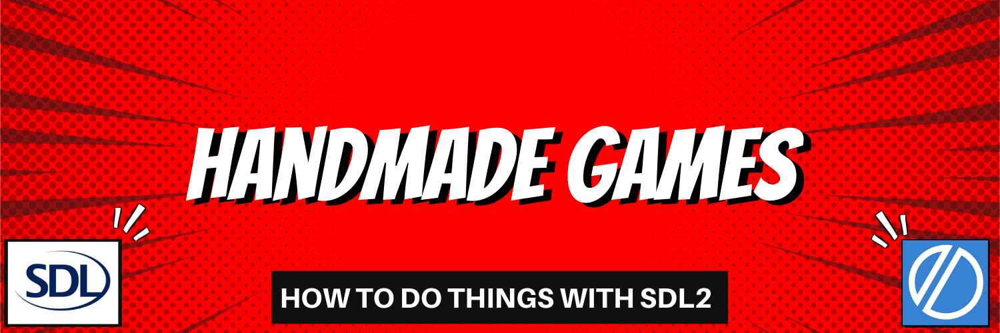

To-the-point examples on how to do things with SDL2 and the Odin programming language.

* [SDL2](https://www.libsdl.org/)
* [Odin](http://odin-lang.org/)

SDL2 is a powerful library that makes it a bit easier to program games for multiple platforms.

If you're interested in programming games from scratch, using SDL2 and the Odin programming language, please check out my YouTube channel - [Handmade Games](https://youtube.com/@handmadegamesdev) and follow me on [Twitter](https://twitter.com/_handmadegames).

----

## Running These Examples

Each folder contains all files needed to run that particular example.

To compile and run each example simply navigate into that folder using your favorite terminal and run the following:

`odin run .`

## About Handmade Games

Handmade Games is an effort to encourage and help others to make games from scratch, without the use of existing game engines like Godot, Unreal, or Unity.

Whether you're just **learning how to program**, or you're an experienced programmer just **learning how to program games**, you'll find lots of material to help you on your way.

## Beginners Learning to Code

Most people interested in learning how to code end up learning to program in the context of web development.

While web development can be fun, it is complex, and beginners are usually forced to learn a lot of secondary technology before they can start writing interesting programs.

In the earlier days of computing, many skilled programmers got their start by programming their own games. It is a fun, creative, challenging, and very effective way to learn how to code.

## Learn to Code by Making Games

If you'd like to learn how to code, follow me on [YouTube](https://youtube.com/@handmadegamesdev) and [Twitter](https://twitter.com/_handmadegames). I'm really busy making a mix of beginner and intermediate-level content to help you learn programming in a unique and fun way.